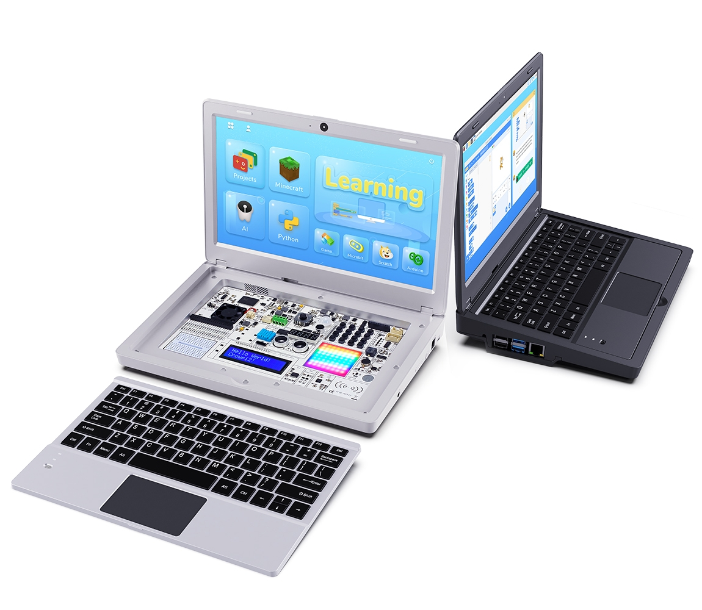

# CrowPi2
  
  

 

# Official CrowPi2 system image
The latest CrowPi2 system image is available [HERE](https://drive.google.com/file/d/1kL1lQcXDQit4ITlbM5aiwib_8aIJ9ziC/view).  

***Note:** It's normal for your system to restart once, when booted for the first time, in order to expand the filesystem automatically.*  

 

# Initial Setup
Run the ***Raspberry Pi Setup Wizard***, it will guide you through the process.  
1. Press **Alt**+**F2**, a ***Run*** dialog box appears  
2. Type the following command, then press **Enter**.   `sudo piwiz`  
3. Follow the on-screen instructions to complete the setup process.  
***Note:** For more details on the Raspberry Pi Setup Wizard, see [HERE](https://www.raspberrypi.org/blog/raspbian-update-june-2018/).*  

 

# Frequently Asked Questions
Solutions to common problems encountered with CrowPi2 can be found [HERE](./faq/TOC-FAQ.md#frequently-asked-questions).  

 

# Known Issues
Known issues that have been found are being listed [HERE](./known_issues/TOC-KI.md#known-issues).  

 

# Caution
Do not use any power bank and the DC-12V power port to power the CrowPi2 at the same time. It will damage the power bank battery and may even pose potential safety risks.  

 

# Helpful resources that could aid with your programming
- [Raspberry Pi offical website](https://www.raspberrypi.org/help/)  
- [Pinout! - The Raspberry Pi GPIO pinout guide.](https://pinout.xyz/)  
***Note:** You may easily display the hardware features of your particular Raspberry Pi board using the command `pinout` in a terminal.*  

 

# Information of CrowPi2 on-board modules

### Digital Module:
| Module             | GPIO pin (Function name)      | GPIO pin (BCM mode)   | GPIO pin (Board mode) |
| -------------------| ------------------------------| ----------------------| ----------------------|
| Relay              | GPIO29                        | [21](https://pinout.xyz/pinout/pin40_gpio21)  | [40](https://pinout.xyz/pinout/pin40_gpio21) |
| PIR motion sensor  | GPIO4                         | [23](https://pinout.xyz/pinout/pin16_gpio23)  | [16](https://pinout.xyz/pinout/pin16_gpio23) |
| Sound sensor       | GPIO5                         | [24](https://pinout.xyz/pinout/pin18_gpio24)  | [18](https://pinout.xyz/pinout/pin18_gpio24) |
| IR receiver        | GPIO28                        | [20](https://pinout.xyz/pinout/pin38_gpio20)  | [38](https://pinout.xyz/pinout/pin38_gpio20) |
| Servo              | GPIO24                        | [19](https://pinout.xyz/pinout/pin35_gpio19)  | [35](https://pinout.xyz/pinout/pin35_gpio19) |
| Stepper motor      | GPIO21, GPIO22, GPIO23, GPIO6 | [5](https://pinout.xyz/pinout/pin29_gpio5), [6](https://pinout.xyz/pinout/pin31_gpio6), [13](https://pinout.xyz/pinout/pin33_gpio13), [25](https://pinout.xyz/pinout/pin22_gpio25) | [29](https://pinout.xyz/pinout/pin29_gpio5), [31](https://pinout.xyz/pinout/pin31_gpio6), [33](https://pinout.xyz/pinout/pin33_gpio13), [22](https://pinout.xyz/pinout/pin22_gpio25) |
| Buzzer             | GPIO1                         | [18](https://pinout.xyz/pinout/pin12_gpio18)  | [12](https://pinout.xyz/pinout/pin12_gpio18) |
| Vibration motor    | GPIO2                         | [27](https://pinout.xyz/pinout/pin13_gpio27)  | [13](https://pinout.xyz/pinout/pin13_gpio27) |
| Touch sensor       | GPIO0                         | [17](https://pinout.xyz/pinout/pin11_gpio17)  | [11](https://pinout.xyz/pinout/pin11_gpio17) |
| RGB matrix         | GPIO26                        | [12](https://pinout.xyz/pinout/pin32_gpio12)  | [32](https://pinout.xyz/pinout/pin32_gpio12) |
| Ultrasonic sensor  | GPIO25, GPIO27                | [26](https://pinout.xyz/pinout/pin37_gpio26), [16](https://pinout.xyz/pinout/pin36_gpio16) | [37](https://pinout.xyz/pinout/pin37_gpio26), [36](https://pinout.xyz/pinout/pin36_gpio16) |
| Tilt sensor        | GPIO3                         | [22](https://pinout.xyz/pinout/pin15_gpio22)  | [15](https://pinout.xyz/pinout/pin15_gpio22) |
| DHT11 sensor       | GPIO7                         | [4](https://pinout.xyz/pinout/pin7_gpio4)     | [7](https://pinout.xyz/pinout/pin7_gpio4)    |

(*See reference for [WiringPi](https://pinout.xyz/pinout/wiringpi) pinout*)

### Analog & [SPI](https://pinout.xyz/pinout/spi) Module:
| Module             | Analog channel                |
| -------------------| ------------------------------|
| Joystick sensor    | SPI1;y-axis:0;x-axis:1        |
| Button matrix      | SPI1;4                        |
| RFID-RC522         | SPIO                          |

### [I2C](https://pinout.xyz/pinout/i2c) Modules:
| Module             | I2C address                   |
| -------------------| ------------------------------|
| Segment            | 0x70                          |
| LCD display        | 0x21                          |
| Light sensor       | 0x5C                          |
