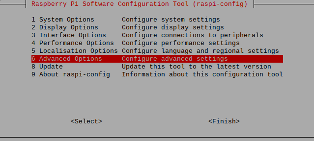
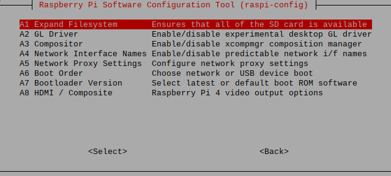

# How to expand the Raspberry Pi filesystem?

1. Open a new Terminal (**Ctrl**+**Alt**+**T**)  
2. Type `sudo raspi-config` and press **Enter** to launch the ***Raspberry Pi Configuration*** app.  
3. Choose the option as highlighted below,  
  
  
4. When a confirmation dialog box appears, press **Enter** to return to the top menu.  
5. Press **Tab** twice to choose **Finish** and press **Enter**.  
6. Choose **YES** and press **Enter** when it prompts to reboot.  

***Note:** The latest Raspberry Pi OS image will expand the filesystem automatically at the initial boot.*  

 

[**<< BACK to FAQs**](./TOC-FAQ.md#frequently-asked-questions)

