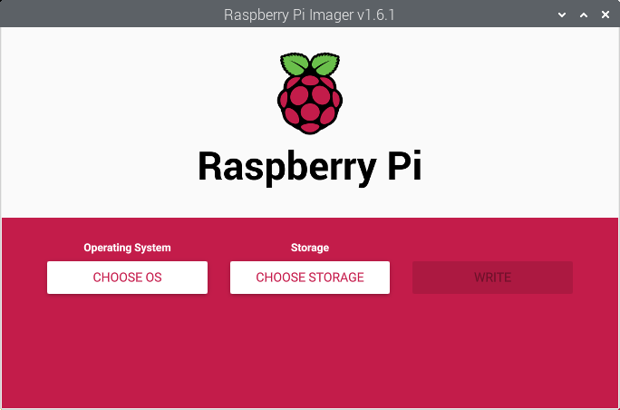
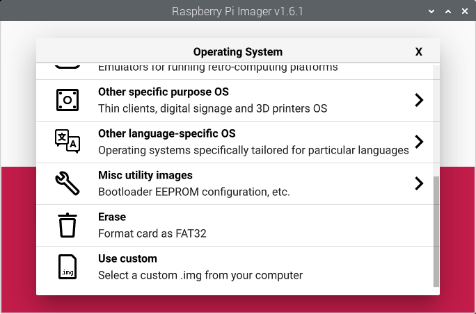
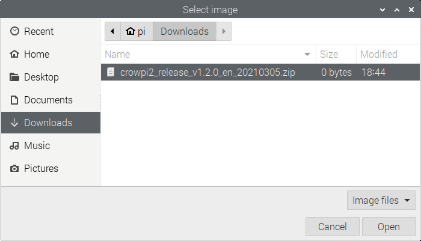
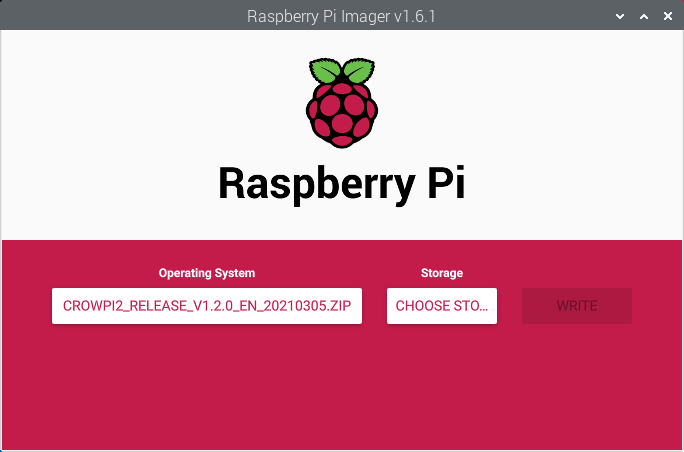
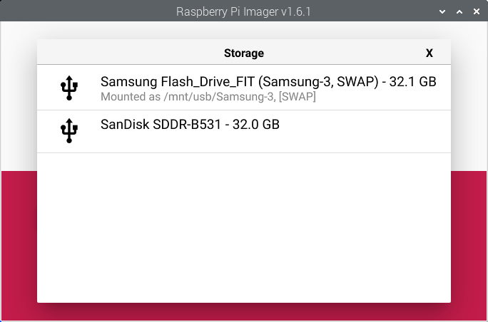
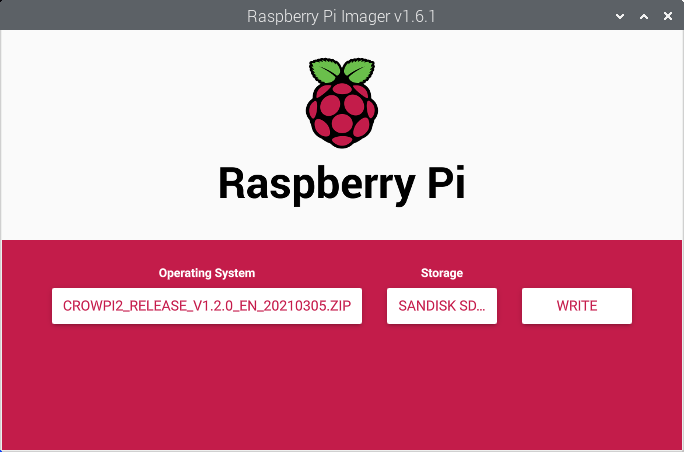
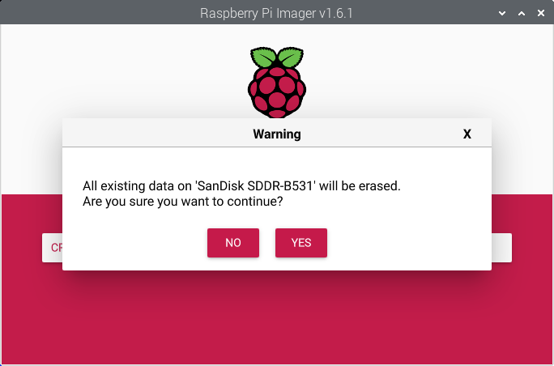
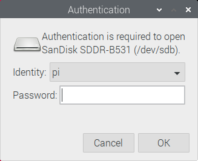
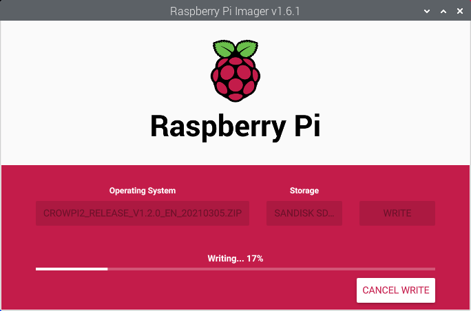
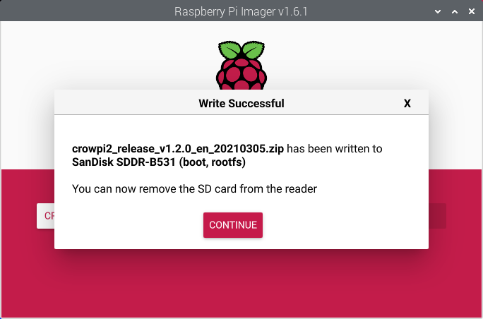

# How to flash a new CrowPi2 system image?

To write a new system SD card, follow the steps below  

1. Download the lastest CrowPi2 system image from this [link](../README.md#official-crowpi2-system-image) and save it to your **Downloads** folder.   
2. Insert a new *microSD card* (32GB or larger) with a *USB microSD Card Adapter* into a USB port of the CrowPi2.  
3. Launch the **Raspberry Pi Imager** app (Menu > Accessories > Imager).  
  
4. Click **CHOOSE OS**.  
  
5. From the ***Operating System*** list, choose **Use custom**.  
  
6. In the pop-up **Select image** windows, choose the **Downloads** folder from the left pane, then select the CrowPi2 image that you have downloaded in step 1 above, (Ex. *crowpi2_release_v1.2.0_en_20210305.zip*) and click **Open**.  
  
7. Click **CHOOSE STORAGE**.  
  
8. From the ***Storage*** list, choose your desired SD Card for flashing with the selected image.  
  
9. Review your selected ***OS*** and ***Storage*** and then click **WRITE**.  
  
10. Click **YES**, when you are ready to start the flashing process.  
  
11. Enter your user password in the pop-up **Authentication** window and press **OK**.  
  
12. After flashing has completed, click **CONTINUE** and close the **Raspberry Pi Imager** app.  
  
13. Congratulation! Your new ***CrowPi2 SD Card*** is now ready for use in the CrowPi2. Shutdown the system, then unplug the power and replace the system SD Card with the new ***CrowPi2 SD Card***.  
14. Lastly, once the system has booted up, run the **Raspberry Pi Setup Wizard** to complete the initial system setup. (See this [link](../README.md#initial-setup) for instructions.)  

 

[**<< BACK to FAQs**](./TOC-FAQ.md#frequently-asked-questions)
