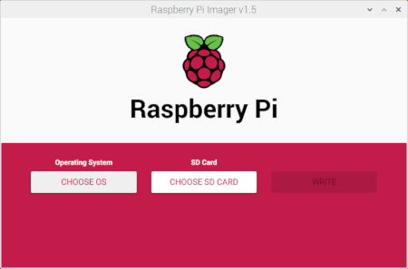
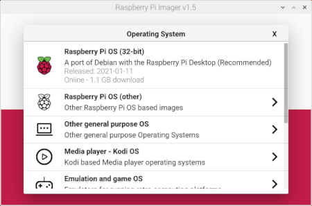
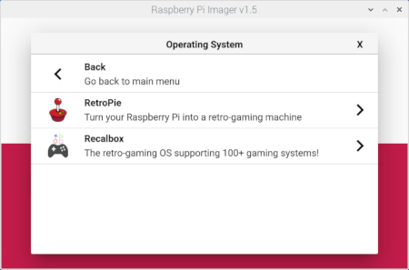
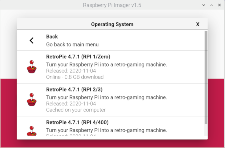
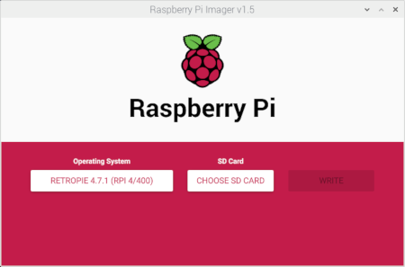
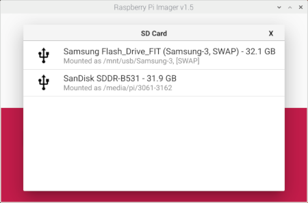
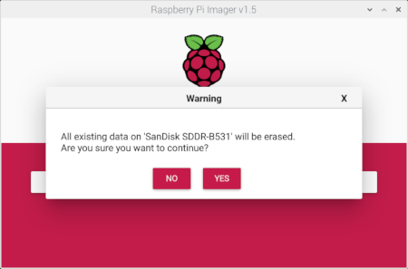
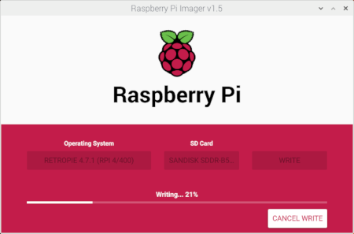
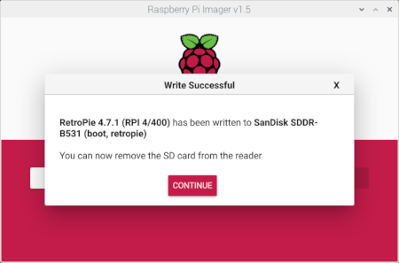

# Can I run different OS on CrowPi2 (ex. Raspberry Pi OS, RetroPie, LibreELEC, Ubuntu, etc.)?

Yes, you may. To write a new system SD card, follow the steps below  
1. Download and flash your desired OS to a new microSD card using the Raspberry Pi Imager. For details, visit the link [Install Raspberry Pi OS using Raspberry Pi Imager](https://www.raspberrypi.org/software/).  
2. Use a text editor, open the ***config.txt*** file under the /boot partition on the new microSD card and add (cut & paste) the follow statements to the end of the file  
```
[EDID=RTK_RTK-FHD]
hdmi_force_hotplug=1
hdmi_group=2
hdmi_mode=82
hdmi_drive=2
enable_uart=1
gpio=0=op,dl
[all]
```


### Example of a step-by-step instructions to flash a RetroPie image on the Crowpi2.

1. Insert a new *microSD card* (32GB or larger) with a *USB microSD Card Adapter* into a USB port of the CrowPi2.  
2. Launch the **Raspberry Pi Imager** app (Menu > Accessories > Imager).  
  
3. Click **CHOOSE OS**.  
  
4. From the ***Operating System*** list, choose **Emulation and game OS**.  
  
5. Choose **RetroPie**  
  
6. Choose the appropriate version for your Raspberry Pi model.  
  
7. Click **CHOOSE SD CARD**.  
  
8. From the ***SD Card*** list, choose your desired SD Card for flashing with the selected image.  
  
9. Review your selected ***OS*** and ***SD Card*** and then click **WRITE**.  
  
10. Click **YES**, when you are ready to start the flashing process.  
  
11. After flashing has completed, click **CONTINUE** and close the **Raspberry Pi Imager** app.  
  
12. Next, you will need to edit the ***config.txt*** file in the newly flashed ***RetroPie SD Card*** before it is suitable for use with the CrowPi2.  
13. Unplug the USB microSD Card Adapter with the ***RetroPie SD Card*** and then plug it back in for it to be mounted in the system.  
14. Open a new Terminal (**Ctrl**+**Alt**+**T**).  
15. Edit the **config.txt** file in the ***RetroPie SD Card*** with your favorite text editor (ex. nano). Type  
`sudo nano /media/pi/boot/config.txt` and press **Enter**.  
16. Cut and paste the following statements to the end of the file.  
```
[EDID=RTK-RTK_FHD]
hdmi_force_hotplug=1
hdmi_group=2
hdmi_mode=82
hdmi_drive=2
enable_uart=1
gpio=0=op,dl
[all]
```
17. Press **Ctrl**+**X**, **Y** and **Enter** to save the file and exit the editor.  
18. Finally, your ***RetroPie SD Card*** is now ready for use in the CrowPi2. Shutdown the system, then unplug the power and replace the system SD Card with the ***RetroPie SD Card***.  

<br>

[**<< BACK to FAQs**](./TOC-FAQ.md#frequently-asked-questions)

