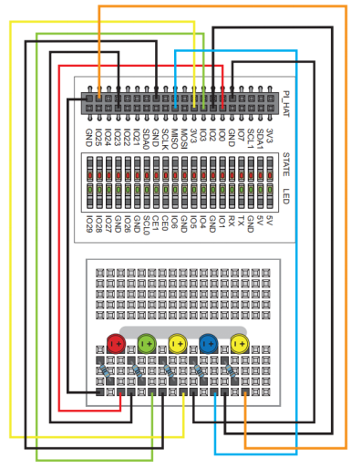

# Error in the Python lesson: Making circuit using the breadboard.

There are errors found in the circuit diagram. The two ends of the resistors should not be positioned in the same column of the breadboard.  

The correct wiring of the circuit is being shown in the pictures below:  
  
  

 

[**<< BACK to Known Issues**](./TOC-KI.md#known-issues)

